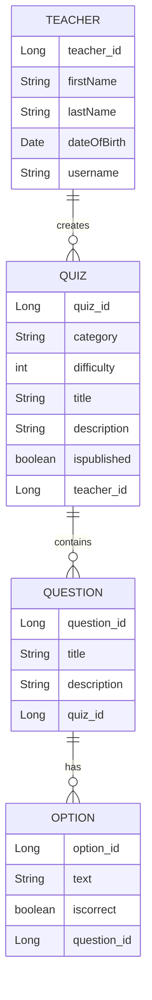

# Quizzer

Quizzer is a lightweight web-based quiz application designed to help users test their knowledge in various subjects. Users can create custom quizzes, take quizzes created by others, and track their performance over time. The project is built using modern web technologies with a focus on usability, responsiveness, and simplicity. It aims to be an educational tool suitable for both self-learners and classroom environments.

## Team members

- [Aku Ihamuotila](https://github.com/akuihamuotila)
- [Jani Könönen](https://github.com/janikononen)
- [Tuomas Jaakkola](https://github.com/tuojaakkola)
- [Tuomas Laalo](https://github.com/TuomasLaalo)
- [Tuomas Leinonen](https://github.com/Leinonen96)

## Additional information

This project is developed as part of the "Introduction to software development projects" course. Contributions follow agile methodologies and GitHub flow practices.

## Product Backlog

[Link](https://github.com/orgs/Triplatuomas-Co/projects/1/views/1)

## Rahti-url
[Link](https://quizzer-git-quizzer-triplatuomas.2.rahtiapp.fi/)

## Flinga 
[Link](https://edu.flinga.fi/s/ENKEQKR)

## User Instructions

## Frontend

Node version 22.13.0

**MacOS & Windows**  
Terminal commands:

```bash
cd frontend
```

```bash
npm install
```

```bash
npm run dev
```

## Backend

Java version 17.0.12

**MacOS**  
Terminal commands:

```bash
cd quizzer
```

```bash
./mvnw spring-boot:run
```

**Windows**  
Terminal commands:

```cmd
cd quizzer
```

```cmd
mvnw.cmd spring-boot:run
```

## Entity Relationship Diagram

